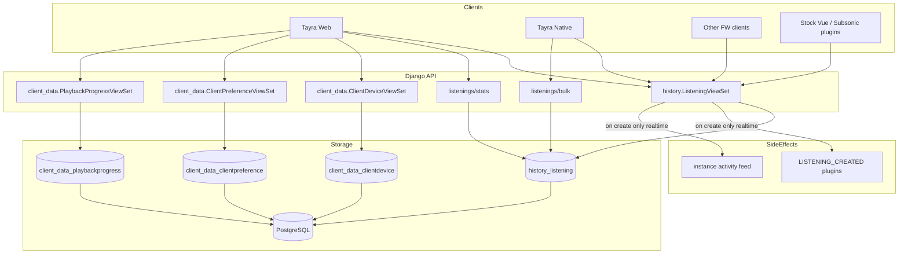
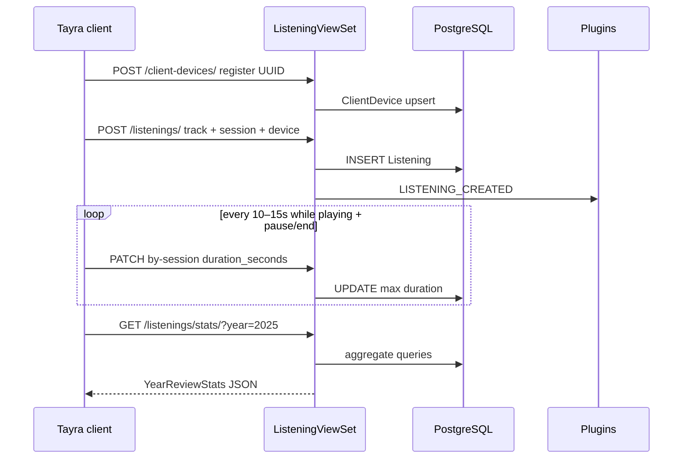
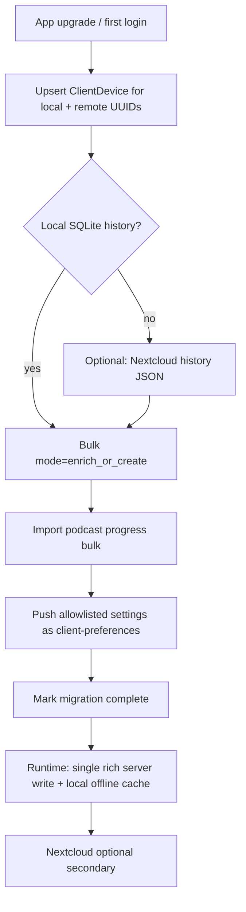
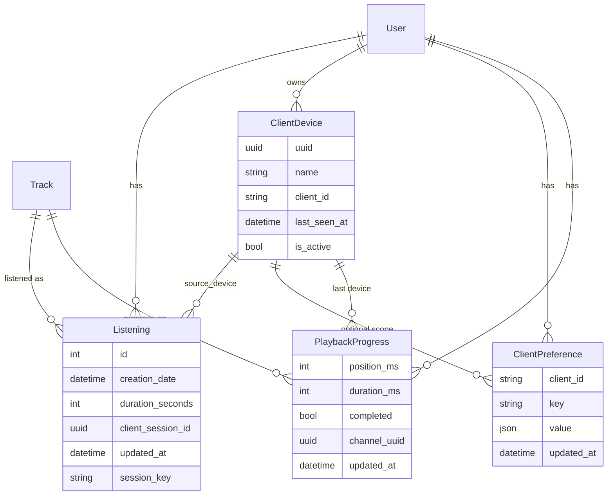

# Server-side rich data APIs for Funkwhale clients

| Field | Value |
| --- | --- |
| **Author** | TBD |
| **Date** | 2026-07-25 |
| **Status** | Draft (revised after design review rounds 1–2) |
| **Audience** | Senior engineers familiar with `api/funkwhale_api` and Tayra |
| **Intended home** | `docs/specs/rich-client-data/` (see [References](#references)) |

---

## Overview

Tayra currently stores **rich client data** outside Funkwhale: detailed listening history (with actual listened duration and multi-device identity) in local SQLite, podcast episode resume progress in SQLite, and settings/history backups via Nextcloud WebDAV. Stock Funkwhale only records a thin `Listening` row (`track` + `user` + `creation_date`) and an unstructured `User.settings` JSON blob used mainly by the Vue SPA.

As Tayra becomes the **primary web UI** (and remains a native app), web clients have no reliable local SQLite / Nextcloud path. This design proposes **first-class server storage and REST APIs** for:

1. **Rich listenings** — duration, device, client session identity, bulk import (with stock-row enrich), and year-in-review stats
2. **Client device registry** — stable per-install UUIDs with human-readable names
3. **Namespaced client preferences** — multi-client, multi-device config with merge semantics (not a second opaque blob)
4. **Playback progress** — podcast (and general) resume / completed state

The design extends the existing `history` app for listenings, introduces a small multi-client `client_data` app for devices / preferences / progress, preserves backward compatibility with stock listening clients and ActivityPub, and defines migration APIs so standalone Tayra installs can upload local and Nextcloud-backed data upstream.

---

## Resolved defaults for v1

These close product choices that would otherwise block implementation (see also [Key Decisions](#key-decisions) K13–K17).

| Topic | v1 default |
| --- | --- |
| Device on listen create/import | **Must be pre-registered** via `POST /api/v1/client-devices/`; unknown UUID → `400 device_not_registered`. No auto-register. |
| Non-owner rich fields | **Always omit** `duration_seconds`, `source_device`, `client_session_id`, `updated_at` for non-owners (list + retrieve). |
| Stats null duration | `total_seconds` = `SUM(COALESCE(duration_seconds, 0))`; also return `listens_with_duration` and optional `estimated_seconds` from track length for null rows. |
| Bulk mode default | `mode: enrich_or_create` — enrich matching stock rows before insert; historical import **must** use bulk (not looped POST). |
| Single-create `creation_date` | May set past only within **5 minutes** of now; older → `400 creation_date_too_old` (use bulk). Future > 5 min rejected. |
| Stats caching | **Not required for v1**; optional later. |
| Retention | **Forever** by default; optional instance setting later. |
| Soft vs hard device delete | **Soft-delete** (`is_active=False`) is default `DELETE`; hard delete only via admin/management. |
| Stats access | Authenticated **self only** (no staff impersonation in v1). |
| Feature detection | Client probes `GET /api/v1/client-devices/` → 404 means unsupported; optional nodeinfo `metadata.features` in PR 8. |
| Export portability | **v1.1** (non-goal for v1); account deletion CASCADE is the only wipe path in v1. |
| Top-N default for stats | **`limit` default 10** (match Tayra year-review). |

---

## Background & Motivation

### Current Tayra local stack

| Concern | Client implementation | Storage |
| --- | --- | --- |
| Detailed listens | `ListenHistoryService` / `ListenRecord` | SQLite `listen_history` |
| Playback tracking | `PlaybackListenTracker` | Insert on track activation; duration every ~2s **locally** |
| Stock server scrobble | `ApiRepository.recordListening` | `POST /api/v1/history/listenings/` `{track}` only |
| Cross-device history | `NextcloudBackupService` | `/.tayra/backups/tayra-history-{uuid}-{host}-{year}.json` (v2) |
| Settings backup | Same | `tayra-settings-{uuid}-{host}.json` (v1) |
| Podcast progress | `PodcastProgressService` | SQLite `podcast_episode_progress` |
| Device identity | SharedPreferences `tayra_device_uuid` | UUID v4 + display name |

**Listen record shape (client):** `track_id`, denormalized titles/artists/album/cover, `duration_seconds` (actual listened time), `listened_at`, `source_device` (`'local'` or remote device UUID).

**Dedup on sync (client):** exact equality of `(track_id, listened_at_ms)` — not a ±1s window (`insertRemoteRecords`). Server bulk uses a slightly looser window to absorb clock skew and datetime truncation (see [Bulk import](#bulk-import)).

**Important dual-write reality:** Tayra already posts thin stock listenings *and* keeps local rich rows. Stock `creation_date` is “now at scrobble time,” which often **does not equal** local `listened_at`. Migration must **enrich** stock rows rather than always insert (K13).

### Stock Funkwhale limitations

`history.Listening` (`api/funkwhale_api/history/models.py`):

```python
class Listening(models.Model):
    creation_date = models.DateTimeField(default=timezone.now, null=True, blank=True)
    track = models.ForeignKey(Track, related_name="listenings", on_delete=models.CASCADE)
    user = models.ForeignKey("users.User", related_name="listenings", null=True, blank=True, on_delete=models.CASCADE)
    session_key = models.CharField(max_length=100, null=True, blank=True)
```

API: `ListeningViewSet` — create/list/retrieve only; write serializer fields `(id, user, track, creation_date)`; plugins (`LISTENING_CREATED` → ListenBrainz / Maloja / scrobbler) and activity feed fire on create. No duration, device, bulk import, duration PATCH, or stats.

`User.settings` JSONField (`max_length=50000`) + `POST /api/v1/users/users/settings/` (`set_settings`) is a flat merge of SPA keys — no client namespace, no devices, no versioning, no denylist for secrets, size-constrained.

### Pain points

1. **Web cannot use SQLite/Nextcloud workarounds** — year-in-review and resume UX break on pure web.
2. **Dual history** — Tayra already writes stock listenings *and* local rich history; they diverge (duration, multi-device); naive re-import would double-count.
3. **Nextcloud is optional infrastructure** — many users never connect it; multi-device merge is incomplete.
4. **Settings on server today are SPA-oriented** — dumping Tayra prefs into `User.settings` collides with Vue keys and risks storing API keys.
5. **Heavy users** — 10k–100k+ listen rows over years need indexes, pagination, optional retention, and server-side aggregation (not “download everything to the browser”).

---

## Goals & Non-Goals

### Goals

1. Server-side storage + REST APIs for rich listenings, devices, client preferences, and playback progress.
2. Architecturally sound multi-client design (not Tayra-only JSON dumps).
3. Migration / import APIs: bulk listen history with **enrich-or-create** against stock rows, settings merge, podcast progress — with dedup and conflict rules.
4. Web viability: server is source of truth when local storage is unavailable or ephemeral.
5. Backward compatibility: existing `POST/GET /api/v1/history/listenings/` clients keep working.
6. OAuth scopes aligned with existing `read:listenings` / `write:listenings` and new scopes where needed.
7. Django migrations, factories, tests following Funkwhale DRF patterns.
8. Incremental PR plan for reviewable delivery.

### Non-Goals

- Federating duration / device / progress over ActivityPub by default (privacy).
- Storing offline audio blobs on the server.
- Replacing Nextcloud for general file backup outside Funkwhale-owned data (Nextcloud becomes optional).
- Full Django admin UX beyond basic list/search for ops.
- Replacing or redesigning ListenBrainz/Maloja/scrobbler plugin contracts beyond remaining compatible with create events.
- Server-side queue persistence (out of scope for v1; queue remains client-local).
- **User-facing full export dump** of rich history/progress/prefs (v1.1 portability; v1 only has list/pagination + account deletion CASCADE wipe).
- Automatically backfilling `duration_seconds` for historical stock rows from track length as “truth” (estimate metric only).

---

## Key Decisions

| # | Decision | Rationale |
| --- | --- | --- |
| K1 | **Extend `history.Listening`** with optional rich fields rather than a parallel `RichListening` table | Single source of truth; plugins, activity, privacy filters, and existing clients continue to work; avoids dual-write forever. |
| K2 | **New `client_data` Django app** for `ClientDevice`, `ClientPreference`, `PlaybackProgress` | Multi-client extensibility; keeps history focused on scrobble/history semantics; avoids overloading `users.User.settings`. |
| K3 | **Do not denormalize track metadata on listenings** | Server always joins `Track` (+ artist/album). CASCADE on track delete matches stock behavior; clients already receive full track payloads on list. Import of orphaned track IDs is rejected with per-row errors. |
| K4 | **Device registry is first-class** (`ClientDevice` with client-generated UUID) | Matches Tayra’s `tayra_device_uuid` model; enables multi-device stats and preference scoping without parsing filenames. |
| K5 | **Client preferences are namespaced key/value JSON**, not a single blob per user | Partial updates, multi-client keys (`client_id` + `key`), optional device scope; avoids SPA/Tayra key collisions and 50KB `User.settings` ceiling. |
| K6 | **Year-in-review stats computed on the server** | Web cannot hold 100k rows in memory; SQL aggregates are cheap with proper indexes; clients keep optional offline compute for native. |
| K7 | **Duration updates via PATCH** (create early; update on pause/seek/end and at **≥10–15s** interval, not every 2s) | Crash resilience without blowing `authenticated-update` (1000/h). Local SQLite may still tick every 2s. |
| K8 | **Bulk import is owner-only, authenticated, rate-limited**, with enrich-or-create | Migration path from SQLite/Nextcloud; idempotent re-runs; avoids double-counting stock scrobbles. |
| K9 | **Rich fields never federate; always stripped for non-owners on REST** | Activity serializers stay thin. List **and** retrieve omit `duration_seconds`, `source_device`, `client_session_id`, `updated_at` when `obj.user_id != request.user.id` (anonymous treated as non-owner). |
| K10 | **OAuth: reuse `listenings` for rich history; add `client_data` for devices/prefs/progress** | Minimizes scope sprawl. Deploying `client_data` into `BASE_SCOPES` **widens** existing broad `read`/`write` tokens automatically; apps that only requested `read:listenings` are unaffected. |
| K11 | **Sensitive preference keys rejected server-side as a *superset*** of current Tayra export rules | Tayra `_isSensitiveSettingsKey` today misses AI `*_api_key` keys; server must still reject them. Client export must be fixed (PR 9b/10). Prefer allowlist for v1 UX keys where practical. |
| K12 | **Conflict policy: last-write-wins on `updated_at` for progress & prefs; listenings append-mostly with session max(duration)** | Simple; matches restore semantics. |
| K13 | **Bulk default `mode: enrich_or_create`** matches stock rows by `user+track+creation_date±window` and PATCHes duration/device instead of inserting when a match lacks rich fields | Prevents year-review double-count after dual-write history. |
| K14 | **Stats: `total_seconds = SUM(COALESCE(duration_seconds, 0))`**; expose `listens_with_duration` and optional `estimated_seconds` | Stock rows undercount “actual listened” time until enriched; do not silently treat track length as actual. |
| K15 | **Devices must be registered before reference** | Cleaner FK integrity; migration always upserts devices first (Appendix A). |
| K16 | **Historical import must use bulk**; single-create rejects `creation_date` older than 5 minutes | Prevents plugin/activity spam via looped POST of backdated listens. |
| K17 | **URL prefix `/api/v1/client-devices/`** (not bare `/devices/`) | Consistent with `client-preferences` / `client_data`; avoids collision with future hardware/push “devices.” |

---

## Proposed Design

### Architecture



### Component placement

| Component | App | Paths (v1) |
| --- | --- | --- |
| Enhanced listenings | `funkwhale_api.history` | `/api/v1/history/listenings/` |
| Bulk import | `history` | `POST /api/v1/history/listenings/bulk/` |
| Stats | `history` | `GET /api/v1/history/listenings/stats/` |
| Devices | `funkwhale_api.client_data` (new) | `/api/v1/client-devices/` |
| Preferences | `client_data` | `/api/v1/client-preferences/` |
| Playback progress | `client_data` | `/api/v1/playback-progress/` |

Register `funkwhale_api.client_data` in `INSTALLED_APPS` (`config/settings/common.py`) **before** migrations that FK from history, and mount routers in `config/urls/api.py` following `history` / `favorites` patterns.

---

### 1. Rich listenings (extend `history.Listening`)

#### Schema changes

```python
# funkwhale_api/history/models.py
class Listening(models.Model):
    creation_date = models.DateTimeField(default=timezone.now, null=True, blank=True, db_index=True)
    track = models.ForeignKey(Track, related_name="listenings", on_delete=models.CASCADE)
    user = models.ForeignKey(
        "users.User", related_name="listenings", null=True, blank=True, on_delete=models.CASCADE
    )
    # Legacy Django session key (radios/history legacy). Leave alone; new clients do not write it.
    session_key = models.CharField(max_length=100, null=True, blank=True)

    # --- new fields (all optional for backward compatibility) ---
    duration_seconds = models.PositiveIntegerField(
        null=True, blank=True,
        help_text="Actual seconds listened in this session (not full track length).",
    )
    source_device = models.ForeignKey(
        "client_data.ClientDevice",
        related_name="listenings",
        null=True, blank=True,
        on_delete=models.SET_NULL,
    )
    # Client-generated UUID for this play session. Not related to session_key.
    client_session_id = models.UUIDField(null=True, blank=True, db_index=True)
    updated_at = models.DateTimeField(auto_now=True)

    class Meta:
        ordering = ("-creation_date",)
        indexes = [
            models.Index(fields=["user", "creation_date"], name="hist_listen_user_date"),
            models.Index(fields=["user", "track", "creation_date"], name="hist_listen_user_track_date"),
            models.Index(fields=["user", "client_session_id"], name="hist_listen_user_session"),
        ]
        constraints = [
            models.UniqueConstraint(
                fields=["user", "client_session_id"],
                condition=models.Q(client_session_id__isnull=False),
                name="hist_listen_unique_user_session",
            ),
        ]
```

**`session_key` vs `client_session_id`:** retain `session_key` for backward compatibility / legacy rows; **new clients use only `client_session_id`**. Do not repurpose `session_key` for UUID sessions.

**Migration notes:**

- Additive nullable columns only — zero downtime, no rewrite of existing rows.
- Existing stock rows remain valid with `duration_seconds=NULL`, `source_device=NULL`.
- Indexes sized for year queries: filter by `user_id` + `creation_date` range is the dominant access pattern.
- **Large pods:** building indexes on big `history_listening` tables can lock under default `CREATE INDEX`. Prefer `SeparateDatabaseAndState` + `CREATE INDEX CONCURRENTLY` in a manual/ops migration for production pods with large history tables, or run `migrate` in a maintenance window. Document in admin upgrade notes.

#### Write API (create)

`POST /api/v1/history/listenings/`

```json
{
  "track": 12345,
  "creation_date": "2026-03-15T18:22:01.000Z",
  "duration_seconds": 42,
  "source_device": "550e8400-e29b-41d4-a716-446655440000",
  "client_session_id": "7c9e6679-7425-40de-944b-e07fc1f90ae7"
}
```

Rules:

- `track` required (unchanged).
- `creation_date` optional (default `now`). **Only the authenticated user** is the row owner. Reject if more than **5 minutes in the future** (`creation_date_in_future`). Reject if more than **5 minutes in the past** (`creation_date_too_old`) — historical import **must** use bulk ([K16](#key-decisions)). Clients may omit `creation_date` for live scrobbles.
- `duration_seconds` optional; max hard cap **24h** (86400); soft check against track duration when known.
- `source_device` is the **device UUID string** on the wire (not integer PK). Server resolves `ClientDevice` for `request.user` with `is_active=True`. If missing → `400` with code `device_not_registered`. If inactive → `400` `device_inactive`. **No auto-register** ([K15](#key-decisions)).
- `client_session_id` optional. Normative idempotent create semantics:
  1. Attempt insert; on success set `instance._rich_created = True`.
  2. On unique violation `(user, client_session_id)`, re-fetch existing row under `select_for_update`.
  3. Apply `duration_seconds = max(existing.duration_seconds or 0, incoming or 0)` (preserve NULL only if both null and no incoming).
  4. If `source_device` provided, set it when different.
  5. Save; set `instance._rich_created = False`.
  6. Prefer `IntegrityError` handling; never 500 on concurrent dual POST.
- `user` always forced from auth context.

##### View-layer wiring (normative — do not rely on serializer alone)

Today’s `ListeningViewSet.perform_create` **always** calls `plugins.trigger_hook(LISTENING_CREATED)` and `record.send` after `serializer.save()`. Stock DRF `CreateModelMixin.create` always returns **201**. Implementers who only change the serializer will re-scrobble on every session re-POST and always emit 201.

**Required overrides on `ListeningViewSet` (ship in PR 2):**

```python
# funkwhale_api/history/views.py
from rest_framework import status
from rest_framework.response import Response

class ListeningViewSet(...):
    def perform_create(self, serializer):
        # serializer.save() / create() must set serializer.instance._rich_created
        serializer.save()
        if not getattr(serializer.instance, "_rich_created", True):
            # Idempotent session re-POST: duration may have been updated; no plugins/activity
            return
        plugins.trigger_hook(
            plugins.LISTENING_CREATED,
            listening=serializer.instance,
            confs=plugins.get_confs(self.request.user),
        )
        record.send(serializer.instance)

    def create(self, request, *args, **kwargs):
        serializer = self.get_serializer(data=request.data)
        serializer.is_valid(raise_exception=True)
        self.perform_create(serializer)
        headers = self.get_success_headers(serializer.data)
        created = getattr(serializer.instance, "_rich_created", True)
        return Response(
            serializer.data,
            status=status.HTTP_201_CREATED if created else status.HTTP_200_OK,
            headers=headers,
        )
```

| Outcome | HTTP | `_rich_created` | Plugins / activity |
| --- | --- | --- | --- |
| First insert (new row) | **201** | `True` | Fire once |
| Re-POST same `client_session_id` (update or no-op) | **200** | `False` | **Do not fire** |
| Thin stock create (no session id) | **201** | `True` | Fire once (unchanged) |

**Required tests (PR 2):**

1. First POST with `client_session_id` → 201, plugin mock called once, activity once.
2. Re-POST same `client_session_id` with higher `duration_seconds` → 200, body shows max duration, **plugin mock not called**, activity not called.
3. Concurrent dual POST same session does not 500; exactly one row; at most one plugin fire.

#### Update API (duration / session)

`PATCH /api/v1/history/listenings/{id}/`

```json
{ "duration_seconds": 180 }
```

- Owner-only write (`OwnerPermission` already on write).
- Mutable: `duration_seconds` (set to max of current and incoming to be monotonic-safe), optionally `source_device` UUID.
- Immutable: `track`, `user`, `creation_date`, `client_session_id`.

**Primary mobile path after create:**

`PATCH /api/v1/history/listenings/by-session/{client_session_id}/`

Same body; owner-scoped lookup by session UUID. Avoids depending on server integer id after crashy restarts if client retained only the session UUID.

**Add mixins:** `UpdateModelMixin` on `ListeningViewSet`.

**Throttle:** map `partial_update` / custom `by-session` to a dedicated rate when needed:

```python
# on ListeningViewSet
throttling_scopes = {
    "partial_update": {"authenticated": "authenticated-listening-update"},
    "by_session": {"authenticated": "authenticated-listening-update"},
    "bulk": {"authenticated": "authenticated-listenings-bulk"},
}
```

```python
# THROTTLING_RATES
"authenticated-listening-update": {
    "rate": "3600/hour",  # up to 1 PATCH/s avg; client should use 10–15s
    "description": "Listening duration updates",
},
"authenticated-listenings-bulk": {
    "rate": "60/hour",
    "description": "Listening history bulk import",
},
```

Client v1 requirement: server dual-write PATCH at **≥10–15s** while playing, and always on pause / seek / track end. Local SQLite may still update every ~2s.

#### Read API and non-owner field stripping

`GET /api/v1/history/listenings/` — existing list + `privacy_level_query`.

**Wire formats:**

| Field | Write | Read (owner) | Read (non-owner) |
| --- | --- | --- | --- |
| `source_device` | UUID string | UUID string | **omitted** |
| `duration_seconds` | int \| null | int \| null | **omitted** |
| `client_session_id` | UUID \| null | UUID \| null | **omitted** |
| `updated_at` | — | ISO datetime | **omitted** |

Optional later: `?expand=device` returns nested `{uuid, name, client_id}` for owners only.

**Stripping mechanism (normative):**

Do **not** use `UUIDField(source="source_device.uuid")` — when the FK is null, DRF attribute walking raises on `.uuid`. Use a method field (or custom field) that returns `None` safely:

```python
class ListeningSerializer(serializers.ModelSerializer):
    source_device = serializers.SerializerMethodField()
    # ... other fields including duration_seconds, client_session_id, updated_at ...

    RICH_FIELDS = ("duration_seconds", "source_device", "client_session_id", "updated_at")

    def get_source_device(self, obj):
        if obj.source_device_id is None:
            return None
        # Prefer select_related("source_device") on queryset for owner reads
        return str(obj.source_device.uuid)

    def to_representation(self, instance):
        data = super().to_representation(instance)
        request = self.context.get("request")
        user = getattr(request, "user", None) if request else None
        is_owner = (
            user is not None
            and user.is_authenticated
            and instance.user_id is not None
            and instance.user_id == user.id
        )
        if not is_owner:
            for key in self.RICH_FIELDS:
                data.pop(key, None)
        return data
```

**Queryset:** extend `get_queryset` / list-retrieve path with `.select_related("source_device")` (in addition to existing user/actor selects) so owner reads do not N+1.

Applies to **list and retrieve**. Nested `user` / `actor` / `track` payloads unchanged. Activity serializers remain thin (no code path through this serializer for federation).

**Required tests:**

1. Owner list/retrieve includes rich fields; `source_device` is UUID string or `null` when unset (no 500).
2. Another authenticated user with target `privacy_level=everyone` sees thin rows (no rich keys).
3. Anonymous (when API auth not required) sees thin public rows.
4. Activity payload / `ListeningActivitySerializer` unchanged.

Filters (extend `ListeningFilter`):

- `creation_date_after`, `creation_date_before`, optional `year=2025` (server expands to range)
- `source_device` = **UUID** → filter `source_device__uuid=`
- `track`, existing `username` / `scope`

Pagination: existing `FunkwhalePagination`; `max_page_size` **100** for history list if useful for tools (import uses bulk).

#### Bulk import

`POST /api/v1/history/listenings/bulk/`

```json
{
  "mode": "enrich_or_create",
  "items": [
    {
      "track": 1,
      "creation_date": "2024-01-02T10:00:00Z",
      "duration_seconds": 200,
      "source_device": "550e8400-e29b-41d4-a716-446655440000",
      "client_session_id": null
    }
  ],
  "dedup_window_seconds": 2
}
```

Response:

```json
{
  "created": 100,
  "enriched": 40,
  "skipped_duplicate": 15,
  "errors": [
    {"index": 40, "code": "track_not_found", "detail": "..."},
    {"index": 41, "code": "device_not_registered", "detail": "..."}
  ]
}
```

**Modes:**

| `mode` | Behavior |
| --- | --- |
| `enrich_or_create` (**default**) | For each item: if session/window match → apply enrich rules (below). Else insert. |
| `create_only` | Never mutate existing rows; match → always `skipped_duplicate`; no-match → insert. |

**Counter rules (normative — decision table):**

| Condition | Counter |
| --- | --- |
| New row inserted | `created` |
| Match found **and** at least one field actually changes (`duration_seconds` increases, or `source_device_id` changes from null/other to incoming) | `enriched` |
| Match found **and** no field change (already equal duration/device; pure no-op) | `skipped_duplicate` |
| `create_only` + any match (session or window) | `skipped_duplicate` (always; no mutate) |
| Session match that only applies max(duration) with a higher incoming value | `enriched` |
| Session match with same-or-lower duration and same device | `skipped_duplicate` |

Enrich never decreases `duration_seconds`. Null → non-null duration is a change → `enriched`.

**Dedup window:** default **2 seconds** (not 1). Rationale: client local dedup is exact millisecond equality, but stock scrobbles use server `now` while local `listened_at` may differ by a second or more, and ISO datetime truncation loses sub-second precision. Window of 2s balances stock reconciliation vs false merges of intentional rapid re-listens (two true listens within 2s of the same track are rare and acceptable to merge for migration). Document that re-listen within the window will not create a second row under bulk.

**Side effects:** always **off** for bulk (`trigger_side_effects` is not exposed in v1, or if present defaults false and `true` returns 400). Historical import must not fan out to ListenBrainz/Maloja/scrobbler.

**Batch limits:** max **500** items/request. One DB **transaction per batch**. Per-row validation errors do not roll back successful rows in the same batch (savepoints per row, or validate-all then apply matched set — prefer **per-row savepoint** so partial success matches response shape). Empty body → 400.

**Scalable matching algorithm (normative):**

1. Resolve all device UUIDs in batch → map uuid→`ClientDevice` (1 query). Unknown → per-row error.
2. Prefetch all tracks in batch by id (1 query). Missing → per-row error.
3. Let `t_min`, `t_max` be min/max `creation_date` in batch expanded by ±window.
4. Prefetch candidate listenings:  
   `Listening.objects.filter(user=user, creation_date__range=(t_min, t_max), track_id__in=track_ids).only(...)`  
   (1 query; for huge users with dense history this range is still bounded by the batch’s time span).
5. Build in-memory indexes: by `client_session_id`; by `track_id` → list of candidates sorted by `creation_date` for window match.
6. Decide create/enrich/skip per item without N+1 queries. **Window tie-break when multiple candidates fall within ±window of an item’s `creation_date`:**
   1. Prefer candidate with **minimum \|Δcreation_date\|** to the item.
   2. If still tied, prefer row with `duration_seconds IS NULL` (enrich thin stock first).
   3. If still tied, lowest `id`.
   Session-id match always wins over window match and is unique by constraint.
7. `bulk_create` for inserts; `bulk_update` for enriches (duration, source_device_id, updated_at).

Cap concurrent bulk requests per user via throttle (one in-flight is enough at 60/h).

**Error codes (central catalog excerpt):** see [Error code catalog](#error-code-catalog).

#### Stats endpoint

`GET /api/v1/history/listenings/stats/?year=2025&limit=10`

Owner/self only (`request.user`); ignore or 403 other usernames. Staff impersonation out of scope.

```json
{
  "year": 2025,
  "total_listens": 4321,
  "total_seconds": 890123,
  "listens_with_duration": 3100,
  "estimated_seconds": 1200000,
  "unique_tracks": 900,
  "unique_artists": 210,
  "unique_albums": 320,
  "top_tracks": [
    {
      "track_id": 1,
      "title": "...",
      "artist_name": "...",
      "cover_url": "https://…",
      "count": 42,
      "total_seconds": 9000
    }
  ],
  "top_artists": [...],
  "top_albums": [...],
  "monthly": [
    {"month": 1, "count": 100, "total_seconds": 20000}
  ],
  "by_device": [
    {"device_uuid": "...", "device_name": "Pixel 8", "count": 2000, "total_seconds": 400000}
  ]
}
```

**Aggregation rules ([K14](#key-decisions)):**

| Metric | Definition |
| --- | --- |
| `total_listens` | `COUNT(*)` of user’s listenings in year |
| `total_seconds` | `SUM(COALESCE(duration_seconds, 0))` — **actual listened only**; stock nulls contribute 0 |
| `listens_with_duration` | `COUNT(*) FILTER (WHERE duration_seconds IS NOT NULL)` |
| `estimated_seconds` | `SUM(COALESCE(duration_seconds, track_duration, 0))` where `track_duration` comes from `Track` metadata / best-effort upload duration join — **secondary**, clearly not “actual” |
| top-N `total_seconds` | same COALESCE(0) rule as `total_seconds` |

Document for UX: “Listening time only counts plays recorded with duration. Older server history may show plays without time until imported/enriched.”

**Joins:** `track__artist` for artist name; `track__album` for album; cover via existing attachment serialization helpers (absolute URL via `federation.utils.full_url` or the same helper `TrackSerializer` uses). **Multi-artist** (`docs/specs/multi-artist/`) is a follow-up: v1 uses single `Track.artist` FK.

`limit` default **10**, max 50.

Caching optional post-v1.



#### Client recording policy (Tayra)

| Platform | Recommendation |
| --- | --- |
| Web | Server SoT: register device; **one** rich POST (not thin + rich); omit `creation_date` (server `now`); PATCH duration ≥10–15s / pause / end; stats API for year-review |
| Native online | **One** server POST with rich fields (omit `creation_date`); stop separate thin `recordListening` once rich API is available; keep SQLite dual-write for offline year-review until migration complete |
| Native offline | SQLite only with real `listened_at`. **Do not** flush backdated sessions via looped single `POST /listenings/` (K16 rejects past >5 min). Catch-up with original timestamps requires **bulk** → blocked until PR 4 (API) + PR 10a (client). |
| Import | Devices first → bulk enrich_or_create (local + Nextcloud) → progress bulk → prefs allowlist |

**Interim PR9 behavior:** dual-write uses a **single** server create with rich fields (no parallel thin scrobble). Online only: omit `creation_date` / use server now. **Timestamp-preserving offline→server catch-up ships with PR 10a**, not PR 9. Until then, offline listens stay local SQLite only. Year-review on native still uses local SQLite; server list may show thin stock history from *previous* app versions plus new online rich rows — acceptable.

---

### 2. Client device registry

```python
# funkwhale_api/client_data/models.py
class ClientDevice(models.Model):
    uuid = models.UUIDField()  # client-generated
    user = models.ForeignKey("users.User", related_name="client_devices", on_delete=models.CASCADE)
    name = models.CharField(max_length=255)
    client_id = models.CharField(max_length=64, help_text="e.g. tayra, funkwhale-web")
    client_version = models.CharField(max_length=64, blank=True, default="")
    last_seen_at = models.DateTimeField(default=timezone.now)
    created_at = models.DateTimeField(default=timezone.now)
    is_active = models.BooleanField(default=True)

    class Meta:
        unique_together = ("user", "uuid")
        ordering = ("-last_seen_at",)
```

API:

| Method | Path | Behavior |
| --- | --- | --- |
| `GET` | `/api/v1/client-devices/` | List own devices |
| `POST` | `/api/v1/client-devices/` | Upsert by `(user, uuid)` — refresh `name`, `last_seen_at`, reactivate if soft-deleted |
| `PATCH` | `/api/v1/client-devices/{uuid}/` | Rename / set `is_active` |
| `DELETE` | `/api/v1/client-devices/{uuid}/` | **Soft-delete** (`is_active=False`). Listenings retain FK. Hard delete only via admin/management command (`on_delete=SET_NULL` on listenings). |

Lookup by UUID string, not integer pk.

---

### 3. Client preferences

#### Model (final constraints)

Funkwhale is **PostgreSQL-only** for production; partial unique indexes are acceptable.

```python
class ClientPreference(models.Model):
    user = models.ForeignKey("users.User", related_name="client_preferences", on_delete=models.CASCADE)
    client_id = models.CharField(max_length=64, db_index=True)  # "tayra"
    device = models.ForeignKey(
        ClientDevice, null=True, blank=True, related_name="preferences", on_delete=models.CASCADE
    )
    key = models.CharField(max_length=255)
    value = models.JSONField()
    updated_at = models.DateTimeField(auto_now=True)

    class Meta:
        constraints = [
            # Account-level (device IS NULL)
            models.UniqueConstraint(
                fields=["user", "client_id", "key"],
                condition=models.Q(device__isnull=True),
                name="clientpref_unique_account_key",
            ),
            # Device-scoped
            models.UniqueConstraint(
                fields=["user", "client_id", "key", "device"],
                condition=models.Q(device__isnull=False),
                name="clientpref_unique_device_key",
            ),
        ]
        indexes = [
            models.Index(fields=["user", "client_id"], name="clientpref_user_client"),
        ]
```

**Required test:** two account-level rows with same `(user, client_id, key)` and `device=NULL` must raise IntegrityError; two different devices may share the same key.

#### Semantics

| Scope | `device` | Use |
| --- | --- | --- |
| Account | `null` | Theme defaults, year-end prompts, analytics opt-in — shared |
| Device | set | Cache sizes, pinned tabs, platform-specific UI |

**Merge policy:**

```json
{
  "client_id": "tayra",
  "device_uuid": null,
  "preferences": {
    "gapless_playback": true,
    "browse_mode": "albums",
    "multi_disc_display_mode": "discSections"
  },
  "mode": "merge"
}
```

- `mode: merge` (default): upsert each key.
- `mode: replace`: delete all keys for `(user, client_id, device)` then insert provided set.
- v1 last-write-wins without optimistic concurrency.

**GET** `?client_id=tayra&device_uuid=` — list of `{key, value, updated_at, device_uuid}`.

**Resolution order:** device-specific key overrides account-level key with same name.

#### Sensitive key policy

Server denylist is a **superset** of Tayra’s current `_isSensitiveSettingsKey` (which only checks `token`/`password`/`secret` substrings and a few OAuth/NC keys — **it does not strip AI API keys today**).

**Reject (400 `sensitive_key_rejected`) if key (case-insensitive) matches any of:**

1. Contains: `token`, `password`, `secret`
2. Exact or suffix patterns: `access_token`, `refresh_token`, `client_secret`, `api_key`, ends with `_api_key`, contains `apikey`
3. Known AI/provider keys: `groq_api_key`, `open_router_api_key`, `openrouter_api_key`, `custom_endpoint_api_key`, `custom_endpoint_url` may stay (URL only); keys containing credentials rejected
4. Nextcloud: `nc_app_password`, keys starting with `nc_` that contain `password`/`token`/`secret`/`login`
5. OAuth material stored under prefs: `server_url` alone is OK for UX; never store tokens

**v1 allowlist recommendation for Tayra → server prefs** (import only these unless key is denylisted):

- `browse_mode`, `gapless_playback`, `use_dynamic_album_accent`, `show_year_end_prompts`, `analytics_enabled`, `multi_disc_display_mode`, `mobile_pinned_tab_indices`, `cache_size_limit_mb`, `auto_download_favorites`, `download_wifi_only`, `auto_download_podcast_episodes`, `auto_download_podcast_episode_count`, `ai_enabled`, `ai_provider_type`, `ai_download_prompt_shown` (no API keys / endpoint secrets)

Unknown keys outside allowlist on **import path** are dropped client-side; server still enforces denylist for any client.

Hard cap: max **200** keys per `(user, client_id, device)`; max JSON value size **8 KiB** per key; total payload **256 KiB** per request.

#### Relationship to `User.settings`

- Leave `User.settings` for Vue SPA / legacy.
- New clients use `client-preferences`.
- No automatic migration of `User.settings` → `ClientPreference`.

---

### 4. Playback progress (podcasts + general resume)

```python
class PlaybackProgress(models.Model):
    user = models.ForeignKey("users.User", related_name="playback_progress", on_delete=models.CASCADE)
    track = models.ForeignKey(Track, related_name="playback_progress", on_delete=models.CASCADE)
    channel_uuid = models.UUIDField(null=True, blank=True, db_index=True)
    position_ms = models.PositiveIntegerField(default=0)
    duration_ms = models.PositiveIntegerField(null=True, blank=True)
    completed = models.BooleanField(default=False)
    updated_at = models.DateTimeField(auto_now=True)
    source_device = models.ForeignKey(
        ClientDevice, null=True, blank=True, on_delete=models.SET_NULL
    )

    class Meta:
        unique_together = ("user", "track")
        indexes = [
            models.Index(fields=["user", "channel_uuid"], name="prog_user_channel"),
            models.Index(fields=["user", "updated_at"], name="prog_user_updated"),
        ]
```

| Method | Path | Behavior |
| --- | --- | --- |
| `GET` | `/api/v1/playback-progress/` | List own; filter `channel_uuid`, `completed`, `updated_at` |
| `GET` | `/api/v1/playback-progress/{track_id}/` | Lookup by track |
| `PUT` | `/api/v1/playback-progress/{track_id}/` | Upsert position |
| `POST` | `/api/v1/playback-progress/bulk/` | Migration import (LWW by `updated_at`) |
| `DELETE` | `/api/v1/playback-progress/{track_id}/` | Clear |

Upsert body:

```json
{
  "position_ms": 125000,
  "duration_ms": 3600000,
  "completed": false,
  "channel_uuid": "…",
  "source_device": "550e8400-…",
  "updated_at": "2026-07-01T12:00:00Z"
}
```

`source_device` wire format: UUID string (same as listenings).

**Conflict:** single PUT: if client `updated_at` is older than server → **409** with server body. Bulk: last-write-wins by `updated_at` (`skipped` counter).

**Completed threshold:** server sets `completed=true` when `position_ms >= 0.90 * duration_ms` if duration present, or honors client `completed`.

**Not listen history.**

---

### 5. OAuth scopes

Extend `funkwhale_api/users/oauth/scopes.py`:

```python
BASE_SCOPES = [
    # ... existing ...
    Scope("listenings", "Access listening history"),
    Scope("client_data", "Access client devices, preferences, and playback progress"),
    # ...
]
```

| Resource | Scope |
| --- | --- |
| Listenings CRUD, bulk, stats | `read:listenings` / `write:listenings` |
| Devices, preferences, progress | `read:client_data` / `write:client_data` |

```python
COMMON_SCOPES = ANONYMOUS_SCOPES | {
    # ...
    "write:listenings",
    "read:client_data",
    "write:client_data",
}
```

**Privilege expansion note:** `ScopePermission.normalize("read")` expands to all current `read:*` children of `BASE_SCOPES`. After deploy, existing first-party and third-party tokens granted broad `read` / `write` **automatically gain** `client_data`. Apps that only requested `read:listenings` / `write:listenings` remain limited. Document in changelog/admin notes so app authors are not surprised.

Anonymous: **no** `client_data`. `read:listenings` remains subject to `anonymous_policy = "setting"`.

Update Tayra `oauth_scopes.dart` labels in client PR 9.

---

### 6. Permissions & privacy

- All `client_data` viewsets: authenticated owner only; no anonymous; no cross-user read.
- Listenings: `privacy_level_query` for list/retrieve of others’ rows; rich fields stripped via `to_representation` ([K9](#key-decisions)).
- Activity / federation: unchanged thin serializers.
- Account deletion: CASCADE removes devices, prefs, progress, listenings.

---

### 7. Storage & performance estimates

| Item | Estimate |
| --- | --- |
| Row size (listening + indexes) | ~200 B with overhead |
| 100k listens | ~20 MB / user worst case |
| Devices / prefs / progress | negligible vs listenings |

**Retention:** default forever; optional `history__listenings_retention_days` later. v1 deletion paths: per-user account delete (CASCADE) only — no user export dump in v1 (v1.1).

---

### 8. Client migration flow (Tayra)



| Local field | Server field |
| --- | --- |
| `track_id` | `track` |
| `listened_at` | `creation_date` |
| `duration_seconds` | `duration_seconds` |
| `source_device` (`local` → this device UUID; remote UUID) | `source_device` |
| Podcast progress | progress upsert |
| Allowlisted SharedPreferences | preference keys under `client_id=tayra` |

Register **every** device UUID appearing in history (local + remote Nextcloud devices) before bulk.

---

## Error code catalog

| Code | HTTP | Where |
| --- | --- | --- |
| `device_not_registered` | 400 | listen create/bulk, progress when device required |
| `device_inactive` | 400 | reference to soft-deleted device |
| `creation_date_too_old` | 400 | single create with past > 5 min |
| `creation_date_in_future` | 400 | create with future > 5 min |
| `track_not_found` | 400 (bulk row) / 400 create | invalid track id |
| `sensitive_key_rejected` | 400 | preferences |
| `batch_too_large` | 400 | bulk > 500 |
| `progress_conflict` | 409 | progress PUT older `updated_at` |
| `not_owner` / 404 | 404 | owner permission pattern (existing) |

### Error payload convention (v1)

Existing Funkwhale validators mostly return plain DRF string lists (`{"field": ["message"]}`). Rich-client-data endpoints use a **structured field-error list** so clients can branch on machine-readable codes without scraping English strings:

```json
{
  "creation_date": [
    {"code": "creation_date_too_old", "detail": "Use bulk import for historical listens"}
  ],
  "source_device": [
    {"code": "device_not_registered", "detail": "Register the device first"}
  ]
}
```

**Rules:**

1. Field-scoped validation → map field name → **list** of `{code, detail}` objects (always a list, even for one error).
2. Non-field errors → `{"non_field_errors": [{"code": "…", "detail": "…"}]}`.
3. Bulk per-row errors (HTTP 200 partial success) use the same shape inside `errors[]`: `{"index": N, "code": "…", "detail": "…"}` (flat, not nested under field names).
4. Implement via a small helper (e.g. `raise_coded_validation_error(field, code, detail)`) used by history + `client_data` serializers; do not invent ad-hoc dict nesting per endpoint.
5. Clients may still treat any 400 as failure; structured codes are for UX and tests.

Bulk partial success always **HTTP 200** with `errors[]` entries carrying codes above.

---

## API / Interface Changes

### Summary table

| Endpoint | Method | Scope | Notes |
| --- | --- | --- | --- |
| `/api/v1/history/listenings/` | GET | `read:listenings` | + filters; rich fields owner-only |
| `/api/v1/history/listenings/` | POST | `write:listenings` | + rich fields; session idempotent max-duration |
| `/api/v1/history/listenings/{id}/` | GET | `read:listenings` | strip rich for non-owner |
| `/api/v1/history/listenings/{id}/` | PATCH | `write:listenings` | duration update |
| `/api/v1/history/listenings/by-session/{uuid}/` | PATCH | `write:listenings` | **new** |
| `/api/v1/history/listenings/bulk/` | POST | `write:listenings` | enrich_or_create |
| `/api/v1/history/listenings/stats/` | GET | `read:listenings` | self only |
| `/api/v1/client-devices/` | GET/POST | `client_data` | **new** |
| `/api/v1/client-devices/{uuid}/` | PATCH/DELETE | `client_data` | soft delete |
| `/api/v1/client-preferences/` | GET/PUT | `client_data` | **new** |
| `/api/v1/playback-progress/` | GET | `client_data` | **new** |
| `/api/v1/playback-progress/{track_id}/` | GET/PUT/DELETE | `client_data` | **new** |
| `/api/v1/playback-progress/bulk/` | POST | `client_data` | **new** |
| `/api/v1/users/users/settings/` | POST | `profile` | **unchanged** |

### Serializer sketch (create + `_rich_created` flag)

```python
def raise_coded(field, code, detail):
    """Shared helper: field → list of {code, detail} (see Error payload convention)."""
    raise serializers.ValidationError({field: [{"code": code, "detail": detail}]})


class ListeningWriteSerializer(serializers.ModelSerializer):
    source_device = serializers.UUIDField(required=False, allow_null=True)
    client_session_id = serializers.UUIDField(required=False, allow_null=True)
    duration_seconds = serializers.IntegerField(required=False, allow_null=True, min_value=0)
    creation_date = serializers.DateTimeField(required=False)

    class Meta:
        model = models.Listening
        fields = (
            "id", "track", "creation_date", "duration_seconds",
            "source_device", "client_session_id",
        )

    def validate_creation_date(self, value):
        now = timezone.now()
        if value > now + datetime.timedelta(minutes=5):
            raise_coded("creation_date", "creation_date_in_future", "Too far in the future")
        if value < now - datetime.timedelta(minutes=5):
            raise_coded(
                "creation_date",
                "creation_date_too_old",
                "Use bulk import for historical listens",
            )
        return value

    def create(self, validated_data):
        from django.db import IntegrityError, transaction
        user = self.context["user"]
        validated_data["user"] = user
        device_uuid = validated_data.pop("source_device", None)
        if device_uuid is not None:
            try:
                validated_data["source_device"] = ClientDevice.objects.get(
                    user=user, uuid=device_uuid, is_active=True
                )
            except ClientDevice.DoesNotExist:
                raise_coded(
                    "source_device",
                    "device_not_registered",
                    "Register the device via POST /api/v1/client-devices/",
                )
        session_id = validated_data.get("client_session_id")
        try:
            with transaction.atomic():
                instance = super().create(validated_data)
                instance._rich_created = True
                return instance
        except IntegrityError:
            if not session_id:
                raise
            # New atomic block required after IntegrityError rolled back the insert
            with transaction.atomic():
                existing = models.Listening.objects.select_for_update().get(
                    user=user, client_session_id=session_id
                )
                incoming = validated_data.get("duration_seconds")
                if incoming is not None:
                    existing.duration_seconds = max(existing.duration_seconds or 0, incoming)
                if "source_device" in validated_data and validated_data["source_device"]:
                    existing.source_device = validated_data["source_device"]
                existing.save(update_fields=["duration_seconds", "source_device", "updated_at"])
                existing._rich_created = False
                return existing
```

See also [View-layer wiring](#view-layer-wiring-normative--do-not-rely-on-serializer-alone) for `perform_create` / `create` overrides that consume `_rich_created`.

---

## Data Model Changes



### Migration strategy

1. Create `client_data` app + initial migration (`ClientDevice`, `ClientPreference`, `PlaybackProgress`) with partial unique constraints.
2. `history` migration adding nullable columns + indexes + partial unique on `(user, client_session_id)`; ops note for concurrent indexes on large tables.
3. Deploy API with privacy strip from day one of rich field exposure.
4. Client: register devices → single rich write path → bulk enrich_or_create → progress/prefs.

No mandatory data backfill for stock listenings (enrich on client import).

### Rollback

- Reverse migrations (lossy for data written after deploy).
- Optional instance preferences to disable bulk/stats later if needed.

---

## Alternatives Considered

### A1. Parallel `RichListening` table (not chosen)

| Pros | Cons |
| --- | --- |
| Zero risk to stock API | Dual-write forever; stats join/union; plugins only see thin rows |

**Rejected.**

### A2. Dump Tayra JSON blobs into `User.settings` (not chosen)

| Pros | Cons |
| --- | --- |
| Minimal schema | 50KB cap; collisions; no queryable history; secrets risk |

**Rejected.**

### A3. Client-side-only stats with server raw export (not chosen)

| Pros | Cons |
| --- | --- |
| Simpler API | 100k rows over web is slow; defeats SoT UX |

**Rejected** as primary; export dump deferred to v1.1 portability.

### A4. New app for everything including listenings (not chosen)

Duplicates history/activity/plugins. **Rejected** for hybrid approach.

### A5. Federate detailed listens (not chosen for default)

Privacy-sensitive. **Rejected** as default.

### A6. JSONField bag on `Listening` for extension attributes (not chosen)

Add a single `extra = JSONField` for client-specific keys without per-field migrations.

| Pros | Cons |
| --- | --- |
| Forward-compatible without migrations | Poor indexing; stats/device filters hard; weak schema validation; becomes junk drawer |

**Rejected:** duration, device, and session id are first-class queryable dimensions for stats and dedup; they deserve columns.

---

## Security & Privacy Considerations

| Threat | Severity | Mitigation |
| --- | --- | --- |
| Exfil of full listen history via stolen OAuth token | High | Scopes; revoke apps; owner-only stats/bulk |
| Third-party app reads AI keys from preferences | High | `client_data` scope; **superset** denylist; client export fix; allowlist import |
| Broad `read`/`write` tokens gain `client_data` | Medium | Document privilege expansion; apps with narrow scopes unaffected |
| Bulk import as scrobble spam | Medium | Bulk never side-effects; single-create blocks old dates; rate limits |
| Looped single POST of historical dates | Medium | `creation_date_too_old` on create; import must use bulk |
| Cross-user device/prefs access | High | Owner queryset filter |
| Duration/device leakage in public REST | Medium | Serializer `to_representation` strip (list+retrieve) |
| Duration/device in ActivityPub | Medium | Thin activity serializer unchanged |
| Preference XSS in admin | Low | Opaque JSON |
| Enumeration of progress | High | No public progress endpoints |

---

## Observability

| Signal | Approach |
| --- | --- |
| Logging | Bulk summary (`created`, `enriched`, `skipped`, `errors`); preference rejections |
| Metrics | `listenings_created`, `listenings_patched`, `listenings_bulk_items`, `listenings_enriched`, prefs/progress upserts |
| Alerting | Bulk 4xx spikes; table growth |
| Admin | Device list (user, uuid, name, last_seen); existing Listening admin |

---

## Rollout Plan

1. Land spec at `docs/specs/rich-client-data/`.
2. Server PRs (see [PR Plan](#pr-plan)).
3. **Feature detection:** clients `GET /api/v1/client-devices/`; **404 → unsupported**. Optionally, PR 8 adds `metadata.features.client_data` / `rich_listenings` to nodeinfo (no existing general feature map — this would introduce one).
4. Tayra: device register → single rich dual-write → import → stats + prefs/progress; demote Nextcloud.
5. Changelog notes OAuth scope widening for broad tokens.
6. Rollback via reverse migrations; clients fall back to local SQLite if 404.

---

## Open Questions

Resolved for v1 in [Resolved defaults](#resolved-defaults-for-v1) / K13–K17. Remaining non-blocking:

1. **Retention default** when admin knob is added — keep forever or e.g. 5 years?
2. **Subsonic scrobble path** — populate duration when Subsonic clients send it?
3. **`User.settings` deprecation timeline** once Tayra is sole primary UI?
4. **Queue multi-device handoff** — still non-goal?
5. **v1.1 export dump** format (JSON archive vs paginated full export)?
6. Opt-in federated duration later?

---

## Risks

| Risk | Severity | Mitigation |
| --- | --- | --- |
| Stock↔rich double-count on import | High | `enrich_or_create` default; tests with dual-write fixtures |
| Null duration stats look empty | Medium | Document metrics; show `listens_with_duration`; optional estimated_seconds |
| Chatty PATCH vs 1000/h update throttle | Medium | Client ≥10–15s; dedicated `authenticated-listening-update` rate |
| Bulk N+1 timeouts | Medium | Prefetch algorithm; batch 500; transaction + savepoints |
| Index build locks on large pods | Medium | CONCURRENTLY / maintenance window |
| Privacy regression if strip lands after rich fields | High | Privacy strip ships in same PR as first rich field exposure (PR 2) |
| Clients double POST thin+rich after upgrade | Medium | PR9 stops thin-only path when rich API available |

---

## References

### Intended documentation home

```text
docs/specs/rich-client-data/index.md
```

### Code references

| Area | Path |
| --- | --- |
| Listening model | `api/funkwhale_api/history/models.py` |
| Listening views / serializers | `api/funkwhale_api/history/views.py`, `serializers.py` |
| History URLs | `api/funkwhale_api/history/urls.py` → `config/urls/api.py` |
| OAuth scopes / permission | `api/funkwhale_api/users/oauth/scopes.py`, `permissions.py` |
| User settings | `api/funkwhale_api/users/models.py`, `views.py` |
| Privacy fields | `api/funkwhale_api/common/fields.py` |
| Throttling | `api/funkwhale_api/common/throttling.py`, `config/settings/common.py` (`THROTTLING_RATES`, `throttling_scopes` on views) |
| Plugins hook | `api/config/plugins.py` `LISTENING_CREATED` |
| Scrobbler plugins | `api/funkwhale_api/contrib/{listenbrainz,maloja,scrobbler}/` |
| History tests | `api/tests/history/` |
| Architecture | `docs/developer/architecture.md` |
| Multi-artist (follow-up) | `docs/specs/multi-artist/` |
| Tayra listen history | `tayra/lib/features/year_review/listen_history_service.dart` |
| Tayra playback tracker | `tayra/lib/features/player/playback_listen_tracker.dart` |
| Tayra podcast progress | `tayra/lib/features/podcasts/podcast_progress_service.dart` |
| Tayra Nextcloud backup | `tayra/lib/core/backup/nextcloud_backup_service.dart` |
| Tayra settings keys | `tayra/lib/features/settings/settings_provider.dart` |
| Tayra OAuth labels | `tayra/lib/features/auth/oauth_scopes.dart` |

---

## PR Plan

### PR 1 — `client_data` app skeleton + device registry

- **Title:** `feat(api): add client_data app and client-devices API`
- **Files:** `api/funkwhale_api/client_data/*`, `INSTALLED_APPS`, `config/urls/api.py`, scopes, `api/tests/client_data/test_devices.py`
- **Dependencies:** none
- **Description:** `ClientDevice` + CRUD/upsert at `/api/v1/client-devices/`. Soft-delete default. OAuth `client_data` scope + COMMON_SCOPES (changelog notes privilege expansion).

### PR 2 — Extend `Listening` schema + serializers **including privacy strip and view create path**

- **Title:** `feat(api): add rich listening fields with owner-only serialization`
- **Files:** history models/migrations/serializers/factories; **`views.py` overrides of `create` + `perform_create`**; queryset `select_related("source_device")`; tests for create, idempotent session (200/no plugins), privacy strip, null `source_device` read
- **Dependencies:** PR 1
- **Description:** Nullable rich columns; UUID wire format via `SerializerMethodField`; require registered device; session create with IntegrityError → max duration + **`_rich_created` flag**; **view-layer gates plugins/activity and returns 200 vs 201**; **`to_representation` strip for non-owners**; single-create `creation_date` age limits + structured error helper. Large-table index ops note.

### PR 3 — Listening PATCH + filters + by-session

- **Title:** `feat(api): listening duration PATCH, by-session update, filters`
- **Files:** history views/filters; `throttling_scopes` + `THROTTLING_RATES` for listening-update
- **Dependencies:** PR 2
- **Description:** UpdateModelMixin; by-session action; date/device UUID filters; throttle for PATCH path.

### PR 4 — Bulk import listenings (`enrich_or_create`)

- **Title:** `feat(api): bulk listening import with enrich-or-create`
- **Files:** history views/serializers; bulk algorithm; throttle `authenticated-listenings-bulk`; `api/tests/history/test_bulk.py`
- **Dependencies:** PR 2 (PR 3 filters help verification tests)
- **Description:** Prefetch-based matching; modes; no side effects; counters per decision table (`created` / `enriched` on actual field change / `skipped_duplicate` on no-op or `create_only` match); multi-candidate **tie-break** (closest time → null duration → lowest id); tests include **stock thin row + rich import enrich** fixture and multi-candidate window.

### PR 5 — Listening stats API

- **Title:** `feat(api): year-in-review stats for listenings`
- **Files:** history stats action/serializers; tests mixed null/non-null durations
- **Dependencies:** PR 2
- **Description:** Metrics per K14; limit default 10; join track/artist/album/cover helpers.

### PR 6 — Client preferences API

- **Title:** `feat(api): namespaced client preferences API`
- **Files:** client_data models (partial uniques)/views; sensitive-key validator; tests
- **Dependencies:** PR 1
- **Description:** GET/PUT merge|replace; denylist **superset**; size limits.

### PR 7 — Playback progress API

- **Title:** `feat(api): playback progress API`
- **Files:** client_data progress model/views; bulk LWW; tests
- **Dependencies:** PR 1
- **Description:** Upsert by track; channel filters; completed threshold 0.90.

### PR 8 — OpenAPI, feature detection, docs spec

- **Title:** `docs: rich client data OpenAPI and spec`
- **Files:** spectacular annotations; `docs/specs/rich-client-data/index.md`; optional nodeinfo `metadata.features`; changelog
- **Dependencies:** PRs 1–7 ideally
- **Description:** Canonical feature probe remains GET client-devices 404; nodeinfo optional enhancement.

### PR 9 — Tayra: device registration + single rich dual-write

- **Title:** `feat(tayra): register client-devices and write rich listenings`
- **Files:** `api_repository.dart`, player/listen tracker, `oauth_scopes.dart`; **also expand `_isSensitiveSettingsKey` for `*api_key*`** (can be PR 9b if split)
- **Dependencies:** PRs 1–3 (**not** PR 4 bulk)
- **Description:** Upsert device; **one** rich POST with **`creation_date` omitted** (server now); stop thin-only scrobble when rich API available; PATCH ≥10–15s / pause / end; keep SQLite for offline. **Offline→server catch-up with original timestamps is explicitly out of scope** until PR 10a (needs bulk); do not single-POST backdated sessions (K16). Interim: pre-import server history may mix old thin + new online rich rows.

### PR 10a — Tayra: listening history import (bulk enrich)

- **Title:** `feat(tayra): import local/Nextcloud listen history via bulk enrich_or_create`
- **Files:** listen history + Nextcloud backup import UI; bulk client
- **Dependencies:** PR 4, PR 9
- **Description:** Devices for all UUIDs; chunked bulk; re-runnable.

### PR 10b — Tayra: progress + preferences import/sync

- **Title:** `feat(tayra): sync podcast progress and allowlisted preferences`
- **Files:** podcast progress service, settings provider, Nextcloud settings restore path
- **Dependencies:** PR 6, PR 7, PR 9 (and 9b sensitive strip)
- **Description:** Progress bulk LWW; prefs allowlist only; reject secrets client-side before upload.

### PR 11 — Tayra: server stats year-in-review (web SoT)

- **Title:** `feat(tayra): year-in-review from server stats API`
- **Files:** year_review providers/screens; web path without SQLite dependency when online
- **Dependencies:** PR 5, PR 10a (import improves `total_seconds`)
- **Description:** Prefer server stats online; native offline fallback to SQLite; Nextcloud optional secondary.

### Suggested parallelization

```text
PR1 ──┬──► PR2 ──► PR3
      │      ├──► PR4
      │      └──► PR5
      ├──► PR6
      └──► PR7
              └──► PR8
PR9 (after 1–3) ──► PR10a ──► PR11
                 └──► PR10b (after 6,7,9)
```

---

## Appendix A — Mapping Tayra Nextcloud formats to API

### History file v2

```json
{
  "version": 2,
  "device": "samsung_sm_s908u",
  "deviceUuid": "550e8400-e29b-41d4-a716-446655440000",
  "deviceName": "Samsung SM-S908U",
  "records": [
    {
      "track_id": 1,
      "duration_seconds": 180,
      "listened_at": 1700000000000
    }
  ]
}
```

Importer:

1. `POST /client-devices/` for each `deviceUuid` (+ display name).
2. Bulk `mode=enrich_or_create` mapping `listened_at` ms → ISO `creation_date`.
3. Drop denormalized titles; skip missing tracks.

### Settings file v1

Older Nextcloud backups **may contain AI API keys** because `_isSensitiveSettingsKey` does not currently strip them. Import must:

1. Client-side strip (fixed denylist + allowlist).
2. Server denylist as backstop.
3. Never send secrets to `client-preferences`.

---

## Appendix B — Minimum viable product (MVP)

1. Client-devices + extended Listening create/PATCH + privacy strip + indexes  
2. Bulk `enrich_or_create`  
3. Stats by year (null-duration metrics)  
4. Playback progress upsert  

Prefs can ship immediately after; year-review web works with 1–3 once import enriches durations.
